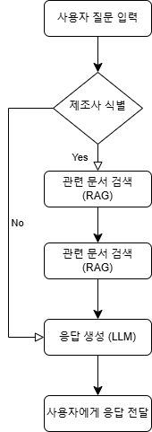
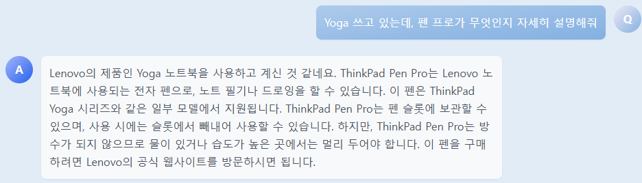
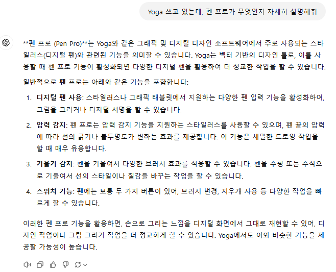
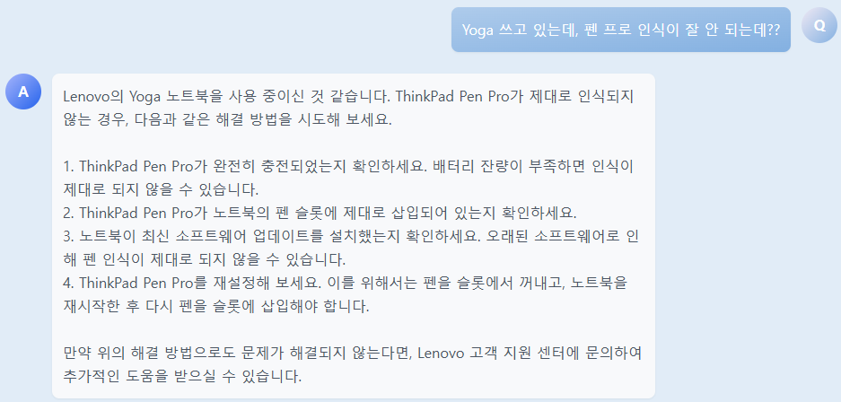
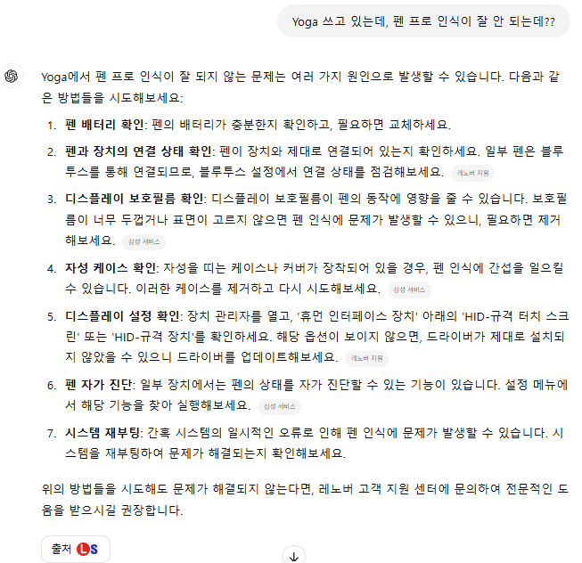

# **노트북 정보 제공 챗봇**

## 1. 문제 제기

### 1) 최신 노트북에 대한 정보 제공  
- 이전에 기록된 정보만 제공되어 최신 노트북에 대한 정보가 제공되지 않았습니다.

### 2) 할루시네이션 발생  
- GPT에서 제공하는 웹 검색 기능을 사용하더라도, 원하는 정보와 동일한 명칭에 대한 정보가 포함되어 할루시네이션이 발생할 수 있습니다.

---

## 2. 최신 노트북 사용 설명 챗봇 소개  
- **RAG (Retrieval-Augmented Generation)** 기반 챗봇 서비스 구현



---

## 3. Task 유형 정의 / 주요 기능

### 1) 대화형 인터페이스 설계 및 구현  
- 사용자 요청을 자연스럽게 처리하는 직관적인 챗봇 UI 개발  
- 사용자 경험(UX) 최적화를 위한 인터페이스 개선  

### 2) DB 생성  
- 최신 노트북 정보가 담긴 데이터베이스 구축

### 3) 대규모 언어 모델(LLM) 활용  
- LLM을 통해 자연스러운 대화와 문맥 기반 응답 생성

### 4) RAG 기법 적용  
- DB 검색 결과를 바탕으로 LLM이 최적의 답변을 생성하도록 설계

---

## 4. 사용 툴
## 아키텍처

### 프론트엔드: Node.js  
  


### 백엔드: FastAPI  
  


### 데이터베이스: Pinecone  


### 모델: LangChain, ChatGPT, Embedding (Upstage), Retrieval (MMR), 테스트 (RAGAS)  
  
  
  
  


### 배포: AWS, Fly.io  
  


### GitHub 도구  
  


---

## 기능

- 사용자가 노트북에 대한 사용 방법을 묻는 경우, 질문 내용에서 노트북 제조사를 식별하는 기능을 추가했습니다.  
- 식별된 노트북 제조사를 기반으로, 사전 학습된 사용 설명서를 참조하여 정확한 답변을 제공합니다.

### 주요 기능

#### 1. 할루시네이션 답변 방지

- **notbot의 답변**  
    

- **OpenAI ChatGPT의 답변**:  
  - "Yoga"는 레노바의 노트북 모델명이지만, 그래픽 디지털 디자인 소프트웨어와 혼동될 수 있습니다.  
  - "Pen Pro"는 스타일러스(디지털 펜)로 혼동될 수 있습니다.  
  

#### 2. 부정확한 답변 방지

- **notbot의 답변**  
    

- **OpenAI ChatGPT의 답변** → 웹 검색을 통한 답변  
  삼성 S펜에 대한 답변도 포함하여 제공되고 있습니다.  
    

---

## 사용법


### [사용 화면]
  


[시연 연상]

https://github.com/user-attachments/assets/9894beb4-9683-4cbd-8fc7-58743e17ae25

---

## 배포된 링크

- **프론트**: [https://main.d23vfmqy5vhe9g.amplifyapp.com/](https://main.d23vfmqy5vhe9g.amplifyapp.com/)  
- **백**: [https://ssafy-2024-back.fly.dev/](https://ssafy-2024-back.fly.dev/)

---
# 로컬 실행 방법


## 프론트엔드 서버 실행 방법

```bash
npm init -y
pip install -r requirements.txt 
npm run build
npm start
```

## 백엔드 서버 실행 방법

```bash
pip install -r requirements.txt 
python app.py
```